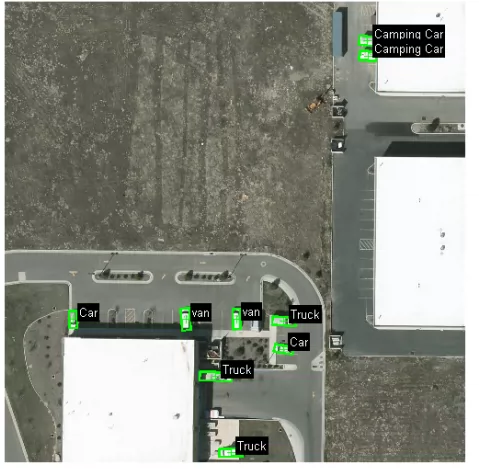
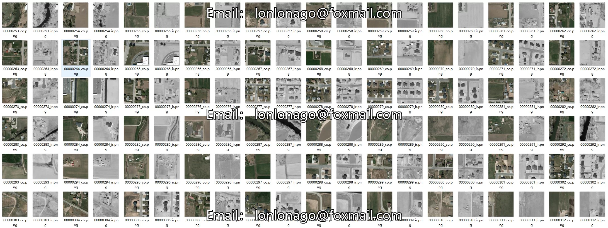
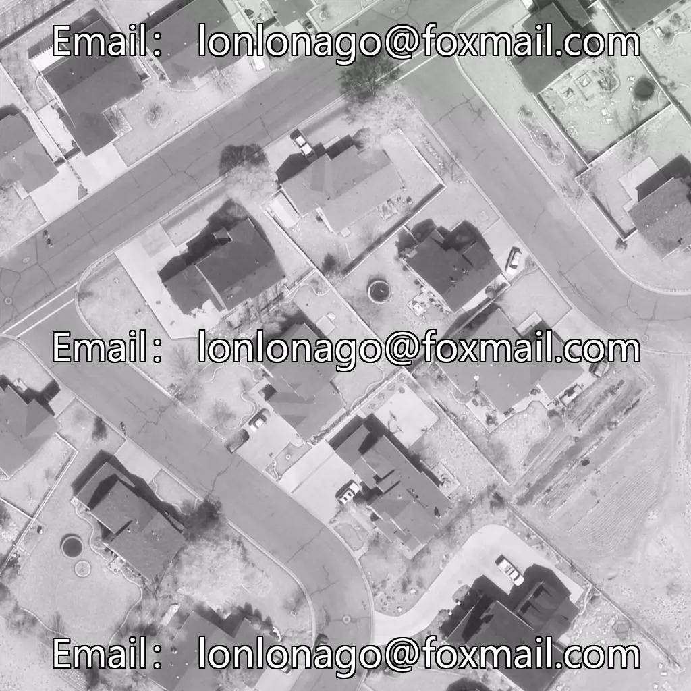
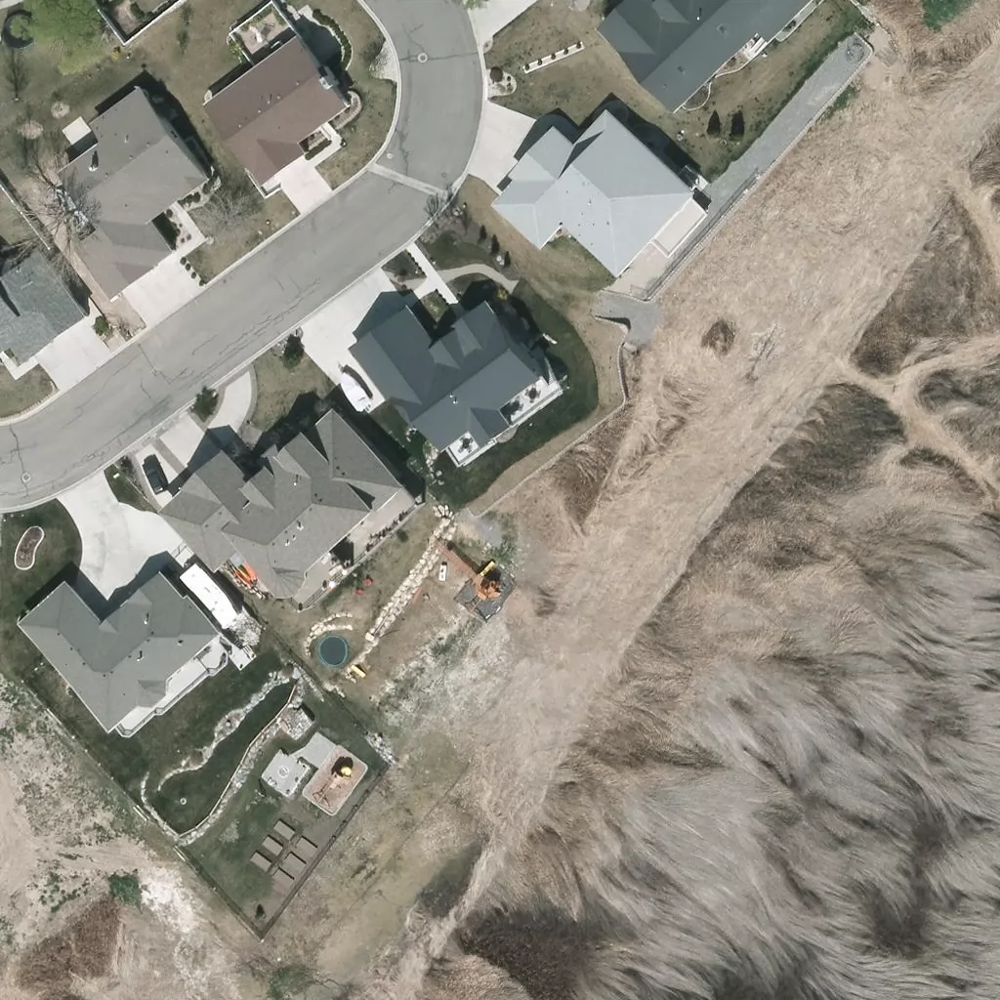
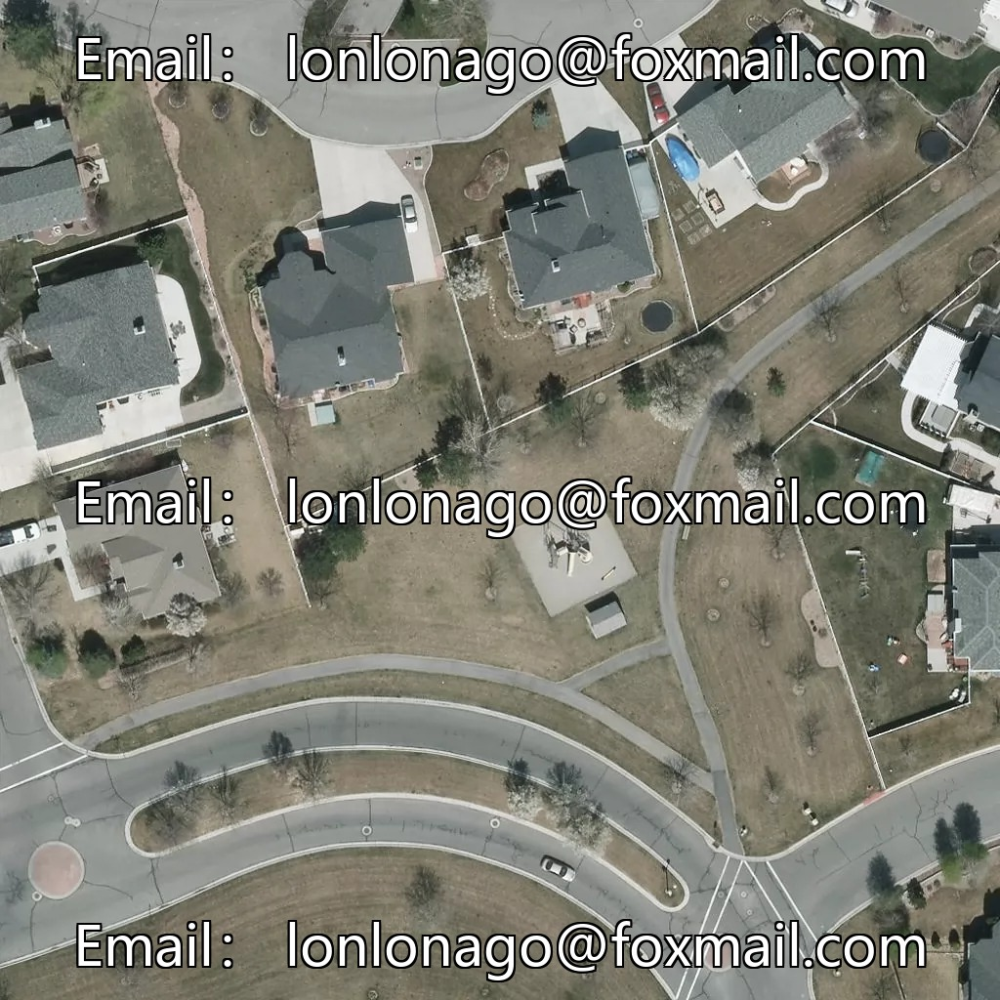

## Body

VEDAI Aerial Image Multimodal Object Recognition Dataset

A specialized multimodal aerial image dataset for remote sensing and aerial photography, featuring pairwise matching of visible light RGB and infrared images.

This dataset includes two sets of complete images: 512×512 resolution images with 2573 images; and 1024 high-definition resolution images with 2538 images.

The annotations include 9 common ground and airborne targets: airplanes, ships, campervans, cars, pickup trucks, tractors, trucks, vans, and other miscellaneous categories.

The original reference paper for the dataset is included along with the official development toolkit.

Electronic virtual products are non-refundable upon sale.

## Images

item_1064948888658

Here is a pay link on Stripe ( https://buy.stripe.com/3cs8yP7sY87d0vu9AB ). Please contact me lonlonago@foxmail.com after funding $89, and I will send you a complete data files , thank you!

